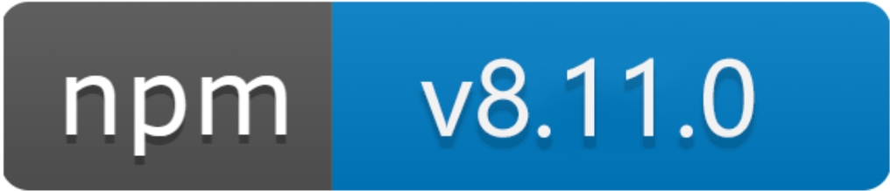

  

致力于开源学习的UI组件库

  

    
    
    
    

  

## ✨ 特性

  <li>🌈 模块化、可迭代性强，耦合度合理、结构清晰、组件与样式分离</li>
  <li>📦 开箱即用的高质量 Vue 组件</li>
  <li>🛡 使用 TypeScript 开发规范性好</li>
  <li>⚙️ 全链路开发和设计工具体系</li>
  <li>🚀 20+ 个高质量组件，覆盖PC端主流场景</li>
  <li>💪 单元测试覆盖率超过 70%，提供稳定性保障</li>
  <li>🍭 支持按需引入和 Tree Shaking</li>

## 安装
<pre>
  <code >npm i lang-ui </code>
</pre>

## 快速开始
<pre>
  <code>import LangUi from 'lang-ui';</code>
  <code>import 'lang-ui/dist/lib/assets/(请前往node_module/lang-ui/dist/lib/assets/查看css文件名字)';</code>
  <code>const app = createApp(App);</code>
  <code>app.use(LangUi).mount('#app');</code>
</pre>
由于 Vue 3 不再支持 IE11，Lang-UI 也不再支持 IE 浏览器

## 在线文档

<a target="_blank" href="https://langlangmountteam.github.io/lang-ui-docs/">https://langlangmountteam.github.io/lang-ui-docs/</a>

## 在线演示站点
- <a target="_blank" href="https://407zk09371.oicp.vip/">https://407zk09371.oicp.vip/</a>

## 使用仓库相关命令

### 安装依赖
<pre>
  <code>npm install </code>
</pre>

### 启动本地测试项目
<pre>
  <code>npm run dev </code>
</pre>

### 打包组件库
<pre>
  <code>rollup -c </code>
</pre>

### 单元测试
<pre>
  <code>npm run test </code>
</pre>

### 测试覆盖率
<pre>
  <code>pnpm run coverage </code>
</pre>

