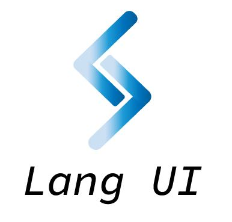
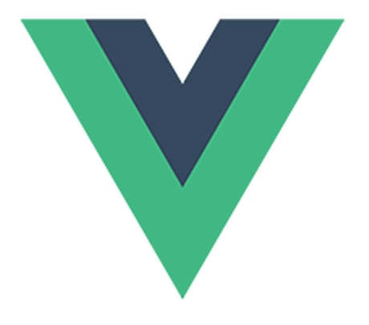
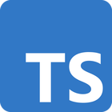

# Lang-UI of Vue3
Lang-UI 是基于 Vue3 TypeScript 设计体系的 Vue UI 组件库

  
  +
  
  +
  

### ✨ 特性

  <li>🌈 模块化、可迭代性强，耦合度合理、结构清晰、组件与样式分离</li>
  <li>📦 开箱即用的高质量 Vue 组件</li>
  <li>🛡 使用 TypeScript 开发规范性好</li>
  <li>⚙️ 全链路开发和设计工具体系</li>
  <li>🚀 20+ 个高质量组件，覆盖PC端主流场景</li>
  <li>💪 单元测试覆盖率超过 70%，提供稳定性保障</li>
  <li>🍭 支持按需引入和 Tree Shaking</li>

### 安装

  
TIP

  
该项目基于Vue3+Vite+TypeScript参考Element-Plus、AntDesign、Vant等~

### 环境支持

由于 Vue 3 不再支持 IE11，Lang-UI 也不再支持 IE 浏览器

### 版本

Lang-UI 目前还处于快速开发迭代中

推荐使用 npm 的方式安装，它能更好地和 rollup 打包工具配合使用

### npm安装

推荐使用 npm 的方式安装，它能更好地和 rollup 打包工具配合使用
<pre>
  <code >npm i lang-ui -S
  </code>
</pre>

